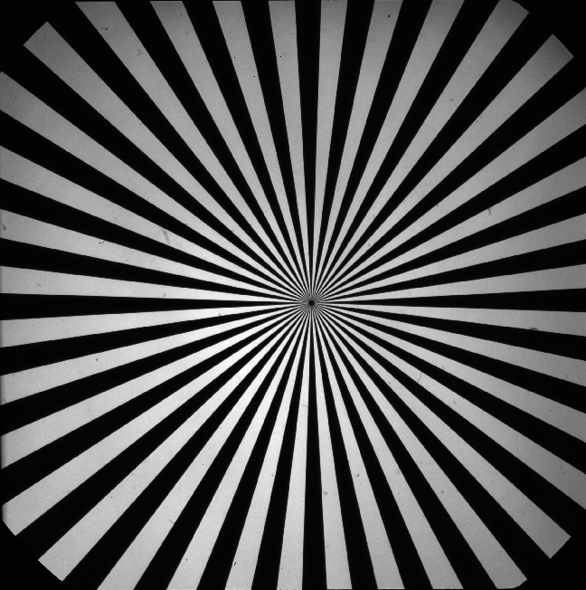

# Introduction
So, without getting to deep, if you're looking to characterize the performance of an optical system, and specifically the image contrast as a function of spatial frequency, we can use optical targets to accomplish this. In this example, we're using a star target consisting of alternating pairs of black and white lines extending radially from a center point. When looking at the image below, you'll see the spatial frequency which here is defined as cycles/pixel where each cycle is a pair of black/white lines, increases as you get closer to the center of the circle. Much of the work here is based on a Python implementation written by Fatima Kahil. She has a nice report found [here](https://fakahil.github.io/solo/how-to-use-the-siemens-star-calibration-target-to-obtain-the-mtf-of-an-optical-system/index.html).

## General Idea
I grabbed Fatima's example image from her website, and it should be noted that her source image was ~2000x2000 and my downloaded/cropped version has a significantly reduced resolution of ~650x650. However, it should be good enough for what we're doing. The star target image I'll be using is below:

    

We know that the image has better contrast and well defined features the further from the center we travel. So, let's first find the center. To do so, we can look at our image and see that the vertical and horizontal lines traveling through the image center will have most of their respective pixels colored black. In an 8bit (256 byte) greyscale image, black is 0, white is 255, and everything else are shades of grey. So, if we look at the the summation of every individual row and column of the image, our lowest value in each would yield us the x and y pixel values denoting the center. If we look at every row, we find:

    

Here we find our x component of the center as being row 345.

If we look at every column, we find:

    

Here we find our x component of the center as being row 335. It is important to note that a 2D pixel array will have the topleft corner have (row, column) indices as (0,0) and bottom right corner as (max row, max column) which in our case is (648,652).

to characterize the contrast we seek to evaluate the pixels along a circluar path at different radii. We'll project a ray at a specified radius from the center from horizontal (theta = 0) then iterate through every angle until we make a full revolution (theta = 2pi). As we iterate through every angle we'll pick up

## Notes
